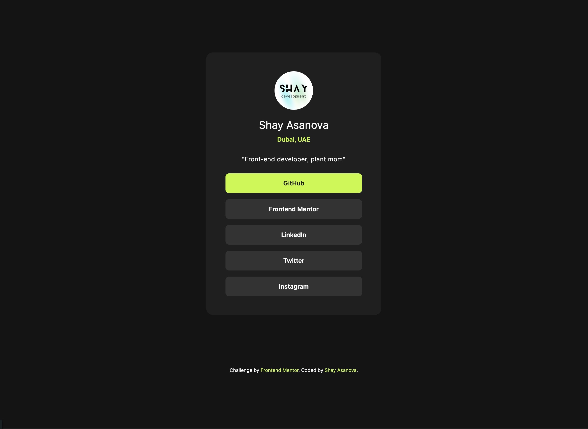

# Frontend Mentor - Social links profile solution


## Table of contents

- [Overview](#overview)
  - [The challenge](#the-challenge)
  - [Screenshot](#screenshot)
  - [Links](#links)
- [My process](#my-process)
  - [Built with](#built-with)
  - [What I learned](#what-i-learned)
  - [What I learned](#what-i-learned)
- [Author](#author)


## Overview
A challenge to create a similar design with pure HTML and CSS. You can use this for own social links on its own or add it as part of website project. You can see the initial design in the design folder and look at the code to see how i tackled it with code.

### The challenge

Users should be able to:

- See hover and focus states for all interactive elements on the page. Links would lead to the social link in a new window. 
- The content should be responponsive and consistent with different viewport sizes.

### Screenshot




### Links

- Live Site URL: [https://shay122990.github.io/socil-links-box/](https://shay122990.github.io/socil-links-box/)

## My process
1. Inspect , identify and count elements on the challenge image.
2. Copy and comment out initial color pallette.
3. Add google fonts.
4. Replace images, edit text.
5. Create simple html. Since this is a simple project on its own, no additional class names were added. 
6. Use flexbox for easier responsivness.
### Built with

- Semantic HTML5 markup
- CSS custom properties
- Flexbox
- Mobile-first workflow

### What I learned

I'e learned that 'max-width'  provide responsiveness by limiting the maximum width of the main container and ensuring it adjusts its width based on the viewport size. It provides consistency and reduces repetitiveness. Otherwise i would have to create multiple '@media' for different viewports. 

To see how you can add code snippets, see below:

```css
    display: flex;
    flex-direction: column;
    justify-content: center;
    align-items: center;
    text-align: center; 
    max-width: 400px; 
    width: 80%;
    margin: 150px auto;
```

## Author

- Frontend Mentor - [@shay122990](hhttps://www.frontendmentor.io/profile/shay122990)

## Hope you found this useful 😀


